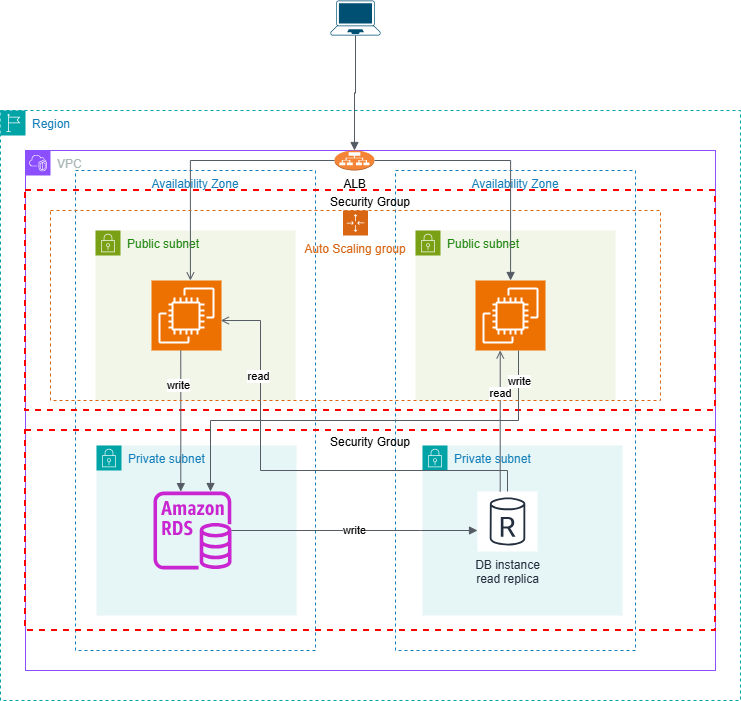

# Highly-Available-3-Tier-AWS-Architecture

A production-grade, fault-tolerance 3-tier web application infrastructure on AWS, featuring **Application Load Balancer, Auto Scaling Group, Multi-AZ RDS MySQL**

## project overview

This project demonstrates a **real-world cloud infrastructure** that can handle traffic spikes, survice availability zone failures, and maintain high performance.

### Key Features
- **High Availability**: Deployed across multiple Availability Zones
- **Auto Scaling**: Automatic scaling based on CPU utilization 
- **Secure**: VPC with public/private subnets, security groups
- **Managed Database**: Multi-AZ RDS with automatic failover

## Architecture Diagram

### Data Flow
1. **User** -> Application Load Balancer (public)
2. **ALB** -> EC2 Instances (public subnets)
3. **EC2** -> RDS MySQL (private subnets, Multi-AZ)
4. **Scaling** -> Cloudwatch Alarms trigger ASG policies

## Technologies Used

| Category               | Technologies                                    |
|------------------------|-------------------------------------------------|
|**Cloud Provider**      |AWS                                              |
|**Compute**             |EC2, Auto Scaling Groups                         |
|**Networking**          |VPC, ALB, Subnets, Route Tables, Internet Gateway|
|**Database**            |RDS MySQL (Multi-AZ)                             |

## Author

This project is maintained by **[Mustakim4](https://github.com/Mustakim4)**. Your feedback and contirbutions are welcome!

**Connect with me:**
- **Github**: [Mustakim4](https://github.com/Mustakim4)
- **LinkedIn**: [Mustakim Diwan](https://www.linkedin.com/in/mustakim-diwan-655a77215/)

## Support the Project

If you found this project helpful, please consider:
- **Starring** the repository
- **Sharing** it with your network
- **contributing** to its improvement